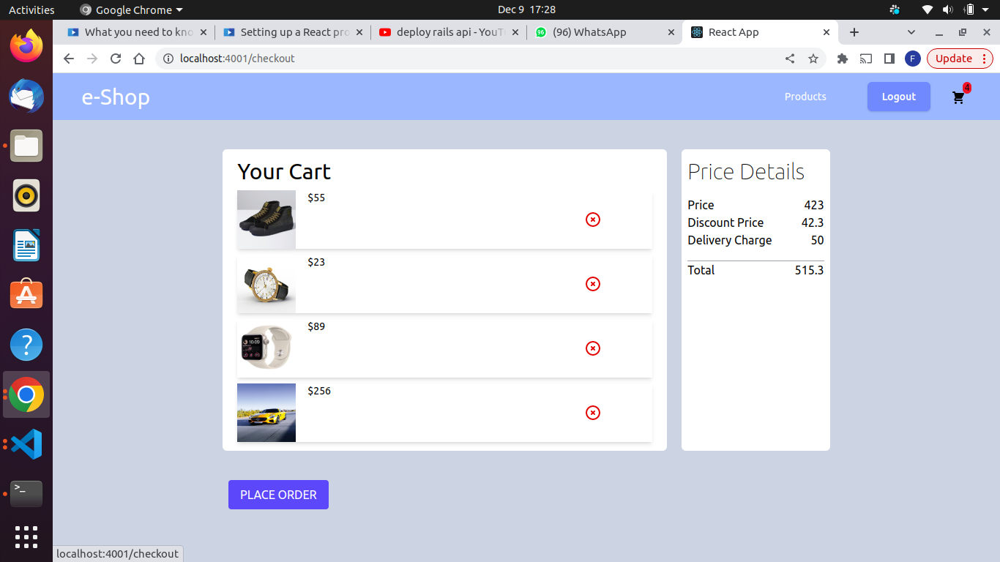

E-commerce

Check out the <a href=""> demo here </a>🎬

e-shop is a single-page e-commerce web application that allows users to purchase products.  
The inspiration of this app came while brainstorming for ideas help people advertise their businesses online to reach out to more customers. The products displayed on the app are a neccessary part of our every day lives.

## Tech Stack
   * Ruby 
   * Rails API 
   * React Js
   * SQLite3
   * Active Record
   * Rack Cors
   * Active Model Serializers
   * Tailwind Css
   * HTML/CSS

## CRUD Operation
  Users can:
   * log in and/or create an account
   * browse all products 
   * see an error message if the account info input is wrong
   * add items to their cart 
   * update their cart by removing items 
   * review cart's total dollar amount before checkout

## Take a Look! 📷

</img> 
</img> 
</img> 
</img> 
</img> 

 ## Set-Up 
   * clone this <a href = "https://github.com/Faith-Muchiri/E-Commerce"> repo </a> into your local environment
   * cd into the repository you just cloned and run 'bundle install' in the command line to ensure all the gems are set in your local system 
   * run 'rails db:migrate' to migrate all the tables for the backend 
   * run 'rails db:seed' to create the seed data
   * run 'rails s' to start the server!
   * cd into the frontend repo that you've just cloned
   * run npm start 'open index.html' to open up your browser and see the app
 

## Build Status
* This project was completed in 7 days for the purpose of the project.

## Future Features for Improvement
   * Improve design elements (look of buttons, image, text manipulation)
   * Create a chekout Function
   * Add review  on each product
   * Update user information
   * Allow users to upload a profile picture
   
## Known Issues
Please see issues
 
## Creator
 * [Faith] (https://github.com/Faith-Muchiri)

 
